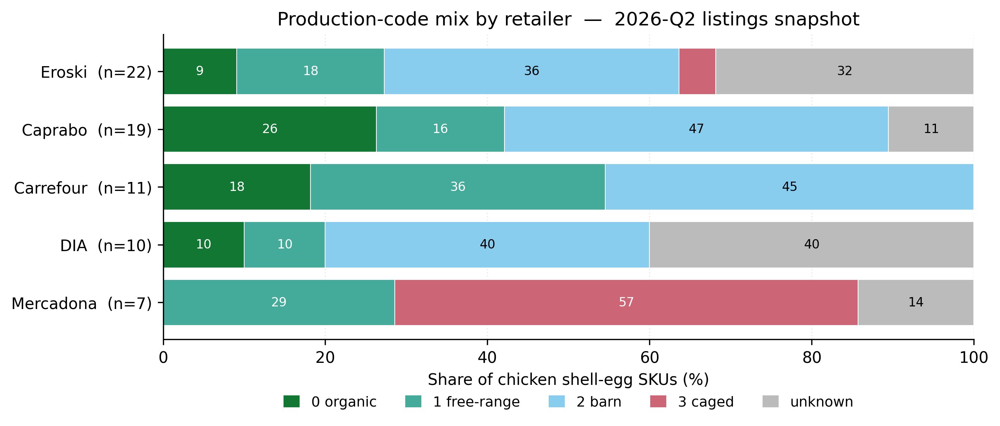
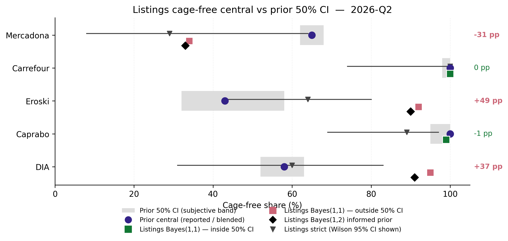

# Listing-level cage-free check on Spain's top-5 grocery retailers — 2026-Q2

**Snapshot 2026-05-04. n = 69 chicken shell-egg SKUs across Mercadona, Carrefour, Lidl, Eroski (with subsidiary Caprabo) and DIA. Quarterly rerunnable scraper at `scraper/`.**

## Headline

- Of the five retailers with both listings data and a prior cage-free estimate, **two (Carrefour, Caprabo) are consistent with the prior at the 50% CI level; three (Mercadona, Eroski, DIA) are not**.
- **Mercadona is the only retailer where caged SKUs remain quantitatively visible**: 4 of 7 shell-egg SKUs carry the regulator-required `criadas en jaulas` disclosure. The listings central is 34% versus a reported 65%, a 31 pp gap. Pack-size weighting narrows but does not close this gap (21--50% depending on how the unknown 24-pack is classified), suggesting the reconciliation lies in sales velocity, not shelf presence.
- **Eroski (+49 pp) and DIA (+37 pp) likely reflect stale priors**, not true overperformance. Eroski's prior rests on a 2018 baseline now eight years old. DIA's strict metric (60%) almost exactly matches its 58% prior; the gap is driven by Bayesian allocation of unknowns.
- **Carrefour discloses `Tipo de producción` on every shell-egg detail page**, the only retailer in the sample doing so. All 11 unique SKUs across Madrid + Barcelona postcodes are explicitly cage-free.
- **Eroski Group (Eroski + Caprabo) combined: n = 41, listings central 96% (Bayes(1,1)), 76% strict.** Useful as a tighter standalone estimate than either subsidiary alone.

## Method

The scraper records every chicken shell-egg SKU listed on each retailer's online catalogue, classifies it by EU production code (0 organic, 1 free-range, 2 barn, 3 caged) and computes a listing-level cage-free share. Classification uses an explicit production-system field where available (Carrefour `Tipo de producción`; Mercadona `mandatory_mentions`; Eroski / Caprabo product-detail `caracteristicas`); otherwise it falls back to keyword in the SKU name (`ecológico`, `campero`, `suelo`, `jaula` and Catalan equivalents). SKUs with no signal are flagged `unknown`. Three central estimates are reported: a **Bayesian Beta(1,1) Laplace shrinkage** (base case, allocates each unknown to cage-free with posterior probability `(cf + 1) / (cf + caged + 2)` of the classified mix); a **Bayesian Beta(1,2) informed prior** with prior mean 1/3 anchored to Spain's national production cage-free share; and a **strict** metric that treats every unknown as not-cage-free, with a Wilson 95% CI. The **consistency test** asks whether each retailer's listings central falls inside the prior task's subjective 50% CI.

## Results

| Retailer | n | Mix (0/1/2/3/?) | Bayes(1,1) | Bayes(1,2) | Strict (95% CI) | Prior (50% CI) | Gap pp | In CI? |
|---|---:|:---|---:|---:|---:|---:|---:|:---:|
| Mercadona | 7 | 0/2/0/4/1 | **34** | 33 | 29 (8--64) | 65 (62--68) | -31 | **no** |
| Carrefour | 11 | 2/4/5/0/0 | **100** | 100 | 100 (74--100) | 100 (98--100) | 0 | yes |
| Lidl | 0 | n/a | -- | -- | -- | 100 (99--100) | n/a | n/a |
| Eroski | 22 | 2/4/8/1/7 | **92** | 90 | 64 (43--80) | 43 (32--58) | +49 | **no** |
| Caprabo | 19 | 5/3/9/0/2 | **99** | 99 | 89 (69--97) | 100 (95--100) | -1 | yes |
| DIA | 10 | 1/1/4/0/4 | **95** | 91 | 60 (31--83) | 58 (52--63) | +37 | **no** |
| **Eroski Grp** | **41** | 7/7/17/1/9 | **96** | 96 | 76 (61--86) | -- | -- | -- |

*Bayes(1,1): Laplace-shrunk posterior on classified SKUs, unknowns allocated proportionally. Bayes(1,2): informed prior (mean 1/3, Spain national CF share). Strict: unknowns counted as not cage-free, Wilson 95% CI. Prior from EggTrack 2024, OBA May 2025 benchmark, and retailer disclosures.*

**Carrefour matches the prior cleanly.** All 11 unique SKUs across Madrid + Barcelona postcodes expose `Tipo de producción` on the detail page; classification is 100% explicit, all cage-free. The 100% point estimate sits inside the 98--100 prior.

**Mercadona is the largest negative gap.** Four of seven shell-egg SKUs carry the regulator-required `criadas en jaulas` ("caged hens") disclosure; two are `camperas` (free-range); one 24-pack is unclassified. The listings central of 34% is 31 pp below the reported 65%. A rough pack-size weighting (inferred from prices, since the API omits pack counts) yields 21--50% depending on how the unknown 24-pack is classified -- still well below 65%, so the gap is not explained by volume weighting alone. The most plausible reconciliation is that `camperas` SKUs dominate actual sales volume, or that corporate figures lag the current shelf state. EggTrack 2024 rates Mercadona "At risk"; OBA's May 2025 benchmark independently confirms the 65% self-report.

**Eroski and DIA: priors look too pessimistic.** Eroski's 43% prior rests on an eight-year-old 2018 ESM baseline (the weakest prior in this analysis). Detail-page enrichment found 14 cage-free, 1 caged, 7 unknown; even a 50/50 split on unknowns gives ~75%, well outside the 32--58 band. DIA's strict metric (60%) matches its prior (58%) almost exactly, but the 4 unqualified own-brand packs are heavily category-correlated, so **the truth likely lies between strict and Bayesian central** for both retailers.

**Caprabo** (n=19, Eroski's Catalan subsidiary) is consistent with the prior (central 99% inside the 95--100 band). **Lidl** stays external-only: lidl.es does not list fresh shell eggs online.

*Figure 1. SKU-level production-code mix per retailer (chicken shell eggs only). Mercadona is the only retailer with explicitly caged SKUs at >0 count; DIA and Eroski carry the highest unknown-classification share. Lidl excluded (no online shell-egg listings).*

*Figure 2. Listings cage-free central (Bayes(1,1) base case + Bayes(1,2) informed prior) and strict-metric Wilson 95% CI versus the prior 50% CI band. Green squares mark listings central inside the prior 50% CI; red squares mark outside. Bayes(1,2) (black diamonds) reflects an informed prior with mean 1/3 anchored to Spain's national production cage-free share. Gap labels in pp at right.*

## What the listings share does and does not measure

This is a **shelf-presence / transparency** indicator, not a sales-share measure. A retailer with 50% cage-free SKUs by count could still sell 80% caged eggs by volume. Corporate figures (and EggTrack tracking) are typically volume-weighted, so divergence between listings and reported is informative but not evidence of misreporting. The listings share also does not capture SKU rotation, postcode variation beyond Madrid + Barcelona, third-party brands at DIA (Soysuper returns DIA-brand only), ingredient eggs, or food-service channels.

## Quarterly watchlist

Stable SKU IDs are written into the schema, so 2026-Q3 will distinguish true SKU additions / removals from label rewording. Specific items to track:

- **Mercadona:** any reduction in the four explicitly caged SKUs (sizes XL/L/L/M, all currently classified `Jaula` in the API).
- **Eroski main:** whether `Huevos L EROSKI 18u`, the single explicitly caged SKU, disappears from the catalogue.
- **DIA:** whether the four unqualified `Huevos M Dia` / `Huevos L Dia` packs become labelled (`de suelo`, `camperos`, etc.). Re-labelling toward cage-free would close the strict-vs-Bayesian gap; persistence supports the asymmetric-prior reading.
- **Carrefour:** extension to additional postcodes (Andalusia, Valencia, Galicia, Canarias) once a residential session is available.

## Sources

| Claim | Source | Tier | Supporting quote |
|---|---|:---:|---|
| Spain national production: 67% caged, 22% barn, 10% free-range, 1% organic (2023 flock) | [WATTPoultry, "Egg sales, consumption break records in Spain"](https://www.wattagnet.com/regions/europe/news/15706648/egg-sales-consumption-break-records-in-spain) | 2 | "Spain houses 67% of its flock in enriched cages." |
| Mercadona 65% cage-free, self-reported | [OBA, Mercadona page](https://observatoriodebienestaranimal.org/actualidad/blog-oba/supermercado-mercadona.html) (citing Mercadona July 2025 reporting) | 2 | OBA attributes 65% to Mercadona's own reporting. Original Mercadona corporate URL no longer accessible. |
| Carrefour, Lidl, Aldi, Ahorramas the only Spanish chains meeting fresh-egg cage-free commitments (May 2025) | [OBA via Sur in English, "Goodbye Code 3"](https://www.surinenglish.com/spain/the-warning-sign-arriving-spanish-supermarkets-dont-20250424062716-nt.html) | 2 | "Only Lidl, Carrefour, Aldi and Ahorramas have kept their promise" re code-3 eggs. |
| Carrefour 100% fresh, 35% ingredient eggs | [OBA, Carrefour page](https://observatoriodebienestaranimal.org/actualidad/noticias/carrefour.html) | 2 | "Carrefour is only at 35% in its commitment regarding the use of cage-free hen eggs as an ingredient in its private-label products." |
| Mercadona end-2022 commitment missed; current target end-2025 | [OBA, Mercadona blog](https://observatoriodebienestaranimal.org/actualidad/blog-oba/supermercado-mercadona.html); [EggTrack 2024](https://www.eggtrack.com/) | 2 | EggTrack 2024 classifies Mercadona "At risk." OBA flags doubts about meeting the 2025 deadline. |
| Top-5 retailer market share ~51% of Spanish FMCG | [Kantar Worldpanel, "Spain top 5 retail chains"](https://www.kantar.com/inspiration/fmcg/spain-top-5-retail-chains-account-for-more-than-half-of-grocery-market-value) | 1 | "Together account for more than half of total FMCG spend." |
| Spain grocery spending 2024 = €122 bn | [ESM via NielsenIQ, "Spanish grocery spending hits record €122bn"](https://www.esmmagazine.com/retail/spanish-grocery-spending-hits-record-e122bn-in-2024-281344) | 2 / 1 | NielsenIQ Consumer Trends 2024. |
| EU egg production codes (0 organic, 1 free-range, 2 barn, 3 caged) | [European Commission, Marketing standards for eggs](https://agriculture.ec.europa.eu/farming/animal-products/eggs_en) | 1 | EU regulatory framework. |
| Soysuper (DIA workaround source) | [soysuper.com](https://www.soysuper.com/) | 3 | Aggregator; used because dia.es is Akamai-blocked at the edge. |

Tier 1 = primary / regulatory / first-party corporate; Tier 2 = trade press citing primary; Tier 3 = aggregator or secondary.

## Tools used and AI disclosure

Tools used: Claude Code (Opus 4.7) for scraper development, comparison-script revision, figure rendering and report drafting; Claude-in-Chrome browser automation for Carrefour multi-postcode capture (Cloudflare workaround); Node.js with cheerio for Eroski / Caprabo HTML parsing and detail-page enrichment; Mercadona public JSON API; Soysuper public JSON API for DIA fallback; Playwright with stealth patches tested for direct DIA access (negative result documented). Statistical methods: Wilson 95% CI for binomial proportions; Bayesian Beta(1,1) and Beta(1,2) posterior-mean allocation of unknown SKUs. Analytical framework, methodology choices and editorial judgement are the author's own.

## Did not do / assumed / skipped / did not verify

- Cage-free % is straight SKU count, not volume-weighted. A rough pack-size weighting for Mercadona (see per-retailer analysis) narrows but does not close the gap.
- DIA: relied on Soysuper aggregator (DIA-brand SKUs only); true DIA n could be 50--100% higher with the full third-party catalogue.
- Carrefour: only Madrid 28232 and Barcelona 08001 postcodes. Eroski / Caprabo: 9 of 41 group SKUs remain unknown after detail-page enrichment.
- Bayesian Beta(1,2) informed prior is anchored to Spain's national production-side cage-free share (~33%); a retail-side anchor was not constructed.
- Wilson 95% CI assumes IID SKUs; does not capture rotation, postcode variation, or volume weighting. Eroski Group combined row treats Eroski + Caprabo as exchangeable.
- Caprabo's 100% (95--100) prior is from a 2022 Eroski sustainability report and may be stale.
